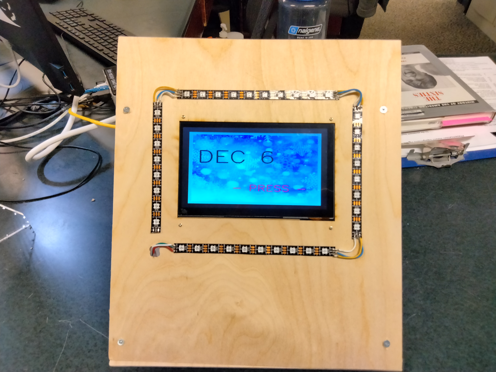

# advent

<h1>Music Video Advent Calendar</h1>

<h2>By: Matthew Swindall</h2>

  For: MTSU Makerspace - Fall/Winter 2021
  
  This project was developed as a demonstrational exhibit for the MTSU Makerspace for the holiday season. The finished product is a kiosk style calendar installation on a touch-   screen that, on activation, plays short, holiday themed music videos along with an LED light show. The kiosk was decorated by Makerspace student workers with 3D printed         ornaments, machine-cut vinyl, and arts supplies. Video clippings were created using https://www.kapwing.com/video-editor.

Hardware
  <ol>
  <li>Raspberry pi 3 model b v1.2</li>
  <li>7" HDMI LCD touchscreen
  <li>Generic USB speaker</li>
  <li>RGB LED strips</li>
  <li>LAN cable</li>
  <li>HDMI cable</li>
  </ol>
Software
  <ol>
  <li>advent.py - main control program</li>
  <li>twinkle.py - syncs LED light show to music video</li>
  <li>advent.desktop - allows advent.py to run automatically on startup</li>
  <li>hidemouse.desktop - disables mouse pointer for touchscreen operation</li>
  <li>setup.sh - bash script to install necessary python libraries and adjust raspi-config settings</li>
  <li>treat.py - !!! For future upgrades !!! utilized GPIO pins to control a stepper motor (will be used to add candy dispenser to kiosk)</li>
  <\ol>
Additional Materials
  <ol>
  <li>Scrap wood</li>
  <li>vinyl</li>
  <li>PLA filament</li>
   </ol>
  <li>soldering equipment/tools</li>
  <li>cotton</li>
 

